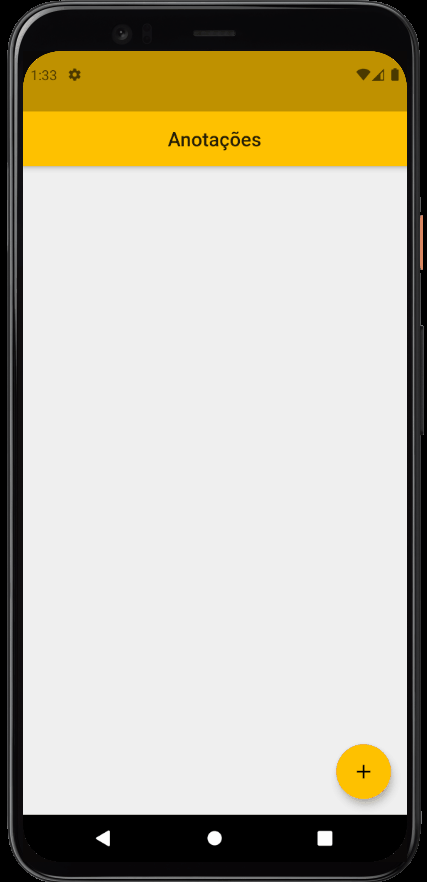

# Notes App - [](https://flutter.dev/)

<h1 align="center">
  
  <p>📝A simple Flutter App to take notes📝</p>
  
</h1>

# Features

- Main page showing all notes
- Add page to add a new note
- Edit page (clicking on note), to edit it
- Edit page (clicking on note), to delete it

## Getting Started

- Clone the repository
- run in cmd:
  ```cmd
  flutter pub get
  flutter run
  ```

## Dependencieis

| Lib    | Link       |
| ------ | ---------- |
| no lib | [no lib]() |

## Device

- Tested in Pixel 4 - Android 11
